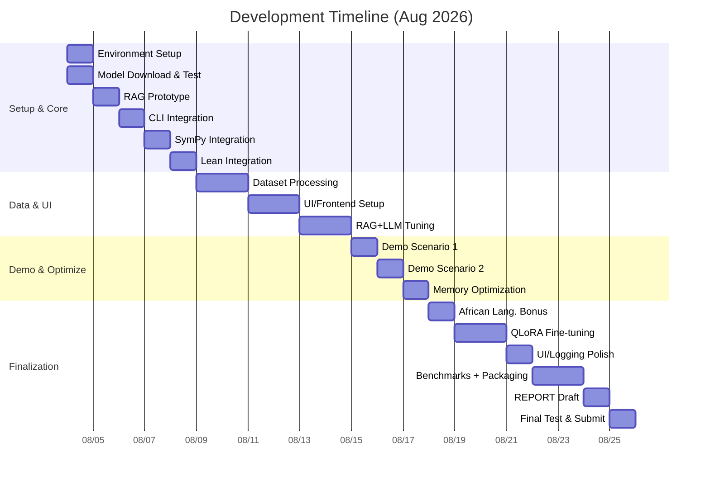

# Theoria: Offline Math & Science Reasoning Workstation (22-Day Hackathon Plan)

**Executive Summary:** We propose **Theoria**, an offline mathematical and scientific reasoning assistant designed for Africa’s budget laptops. Theoria combines a lightweight open LLM (Qwen3-4B quantized) with retrieval of domain knowledge (Mathlib, OpenWebMath, textbooks) and symbolic tools (SymPy, SciPy, Lean4) to excel at math and science tasks on-device. By using *Retrieval-Augmented Generation (RAG)* over local corpora and optimized quantization, Theoria achieves high accuracy on math problems while never exceeding the 7 GB RAM limit. We target the ADTC 2026 judging criteria: **Accuracy (50%)** through domain-specific knowledge and formal verification tools; **Performance (30%)** by using a 4B-parameter Qwen3 model compiled via llama.cpp for responsive speed; and **Efficiency (20%)** by aggressive quantization (Q4_K_M) and memory management. The development plan covers a 22-day sprint, delivering a working CLI/Electron app by Gate 1 (Aug 25), with stretch goals (Lean proofs, African-language QA, advanced UI) thereafter. We will document the architecture and benchmarks thoroughly per ADTC requirements. Theoria enables cross-disciplinary reasoning (mathematics, physics, chemistry) offline, democratizing access to high-end computation on African hardware.

**Winning Pitch (ADTC Criteria):** Theoria directly addresses the *Math & Scientific Reasoning* domain with an on-device LLM enhanced by authoritative sources. By embedding **Lean/Mathlib** (formal mathematics library), **OpenWebMath** (14.7B-token web math text), textbooks (OpenStax) and graded-problem datasets (miniF2F, ProofNet, GSM8K), Theoria ensures high **accuracy** on its niche tasks. Offline inference guarantees **efficiency**: The model is quantized to 4-bit (Q4_K_M) and runs entirely on CPU on an 8 GB laptop, keeping peak RAM under 7 GB to avoid disqualification. System-level optimizations (like caching, careful context sizing) boost **speed** so answers appear interactively (aspiring to the top TPS benchmarks). By targeting Africa’s commodity hardware, Theoria democratizes AI access as envisioned by ADTC. Our design emphasizes modularity and reproducibility: all components (Rust backend, Python tools, Electron UI) are open-source and scriptable. This comprehensive approach – merging symbolic math engines, curated knowledge, and a lightweight LLM – aligns with ADTC’s mandate to “optimize across the full stack: model selection and fine-tuning, quantization, memory management, RAG over local corpora, and responsive UX”. 

## MVP Features (Gate 1) and Stretch Goals
- **MVP (by Aug 25):** A command-line interface (CLI) plus simple GUI (Electron) that accepts math/science queries. It performs retrieval from a local SQLite-VSS vector store (built from Mathlib, OpenWebMath, GSM8K, etc.) and invokes the quantized Qwen3-4B model via llama.cpp to generate answers. Core features include basic arithmetic and algebra solving via SymPy; scientific calculations via NumPy/SciPy; and proof hints by combining LLM output with Lean verification (e.g. generate Lean code and verify with Lean4). The system will produce references/snippets from retrieved docs (e.g. show the Lean theorem statement or textbook excerpt used), demonstrating RAG. We will measure and display performance metrics (RAM, TPS). All source code, model download scripts, and a 2-minute demo are prepared by Gate 1.  
- **Stretch (post-Gate1):** Extend reasoning with *formal proof verification*: generate Lean4 proofs that Lean checks (full example proofs from ProofNet/minif2f); add plot/graph generation via Matplotlib; support queries in French/Arabic (African languages bonus); polish the Electron UI (syntax-highlighting, offline graphics); and optionally perform a QLoRA fine-tune on math datasets to improve domain accuracy. Each stretch feature further boosts accuracy or UX for final scoring.

## System Architecture

```mermaid
flowchart LR
  A[User] -->|asks questions| B[Electron Frontend (React)]
  B --> C[Rust Backend API]
  C --> D[llama.cpp Inference (Qwen3-4B GGUF)]
  C --> E[SQLite-RAG Vector Store]
  C --> F[SymPy & SciPy Tools (Python)]
  C --> G[Lean4 Proof Engine]
  E -->|embeddings→| D
  F -->|calls into| D
```

The frontend (Electron/React) calls a local Rust server (`backend/`) which orchestrates retrieval and inference. The Rust code spawns `llama.cpp` for LLM inference using the quantized GGUF model. Retrieval uses an on-disk SQLite database (with SQLite-VSS extension) storing chunk embeddings. The Rust server also invokes Python (via subprocess or embedding) for SymPy/SciPy math, and runs Lean4 CLI to verify/generated proofs. All components communicate via local IPC/REST for minimal overhead. This modular architecture ensures each layer (UI, core LLM, RAG, tools) is isolated and optimizable. The storage of embeddings on SSD fits the 256 GB hardware, and no network calls are made in inference. 

## Technology Stack and Versions
- **OS/Hardware:** Ubuntu 22.04 LTS on Intel i5 (10th–12th gen), 8 GB DDR4 RAM, no discrete GPU. All code must run on this spec and fit under 7 GB RAM during inference.  
- **Base Model:** Qwen3-4B (3.6B non-embed params) downloaded as a GGUF weight. Use the Q4_K_M quantization format for minimal memory. Alternative models (if needed): Phi-4-mini (2B), Mistral-7B (quantized), Vicuna-7B (quantized) – but Qwen3-4B is chosen for its math-specialized reasoning improvements.  
- **LLM Inference:** [llama.cpp](https://github.com/ggerganov/llama.cpp) latest commit, built with GGUF support. We set context size `--ctx 1024` to limit KV cache, and use `-c 1024` or `--batch 32`, `-n 512`. Example: `llama-cli -m model/Qwen3-4B.Q4_K_M.gguf -c 1024 -b 32 -n 256 --temp 0.2`.  
- **Embedding Model:** [BGE-small-en-v1.5](https://huggingface.co/BAAI/bge-small-en-v1.5) sentence-transformer (384-d, 33M parameters) for embedding chunks. Alternative: `sentence-transformers/all-mpnet-base-v2`.  
- **Vector Database:** SQLite 3.39+ with [sqlite-vss](https://github.com/martinus/SQLite-VSS) extension (or FAISS as a fallback). We create a `vss_index` table with 384-d embeddings (dimensions).  
- **Programming Languages:** Rust (1.70+), Python (3.10+), JavaScript/TypeScript (Node.js 18, React 18, Electron 22) and Tailwind CSS.  
- **Python Libraries:** `sympy==1.14` (symbolic math), `numpy==1.25` (scientific computing), `scipy==1.10` (optimization, integration), `sentence-transformers==2.2`, `sqlite-vss`.  
- **Lean4:** Latest Lean4 toolchain (Lean 4.0+). Mathlib4 (Lean’s math library) for reference.  
- **Packaging:** `electron-builder` for Linux x64 (AppImage or .deb), `cargo` for Rust, `pip` offline wheels for Python. 

## Repository Layout (Theoria/)
```
theoria/
├── app/                    # Electron/React frontend (src/, public/, package.json)
├── backend/                # Rust server (src/, Cargo.toml)
├── inference/              # llama.cpp build & model scripts
│   ├── build/              # llama.cpp build artifacts
│   └── download_model.sh   # script to download Qwen3-4B-GGUF
├── rag/                    # Retrieval scripts and data
│   ├── embed.py            # Python script to embed and populate SQLite
│   └── theoria.db          # SQLite vector DB (excluded via .gitignore)
├── tools/                  # Helper scripts (e.g. SymPy solver, Lean wrapper)
├── data/                   # Raw datasets (cloned/converted, e.g. Mathlib, OpenWebMath, GSM8K.json)
├── docs/                   # Architecture diagrams, user guide, benchmarks
│   └── REPORT_template.md  # ADTC report structure outline
├── .gitignore             
├── metadata.json           # ADTC submission metadata
├── download_model.sh       # Clones or downloads model to `model/`
└── README.md              
```
Model weights (.gguf) are **NOT** committed (listed in .gitignore) and are downloaded on demand via `download_model.sh`. The SQLite DB (`theoria.db`) will be built at runtime or included as a binary asset.

## Sprint Plan (22 Days)
Each day delivers a small buildable increment. “Acceptance” specifies tests to verify functionality. Shell commands illustrate implementation.

- **Day 1 (Aug 4): Setup & Baseline Inference**  
  *Tasks:* Install dependencies: Rust toolchain, Node/Electron, Python3. Build llama.cpp. Write `download_model.sh` to fetch Qwen3-4B GGUF (e.g. from Huggingface or Zenodo). Verify gguf: `file model/Qwen3-4B.gguf`.  
  *Acceptance:* Running `llama-cli -m model/Qwen3-4B.Q4_K_M.gguf -p "2+2"` outputs “4”.  
  *Commands:*  
  ```bash
  # Clone llama.cpp and build:
  git clone https://github.com/ggerganov/llama.cpp.git inference/llama.cpp
  cd inference/llama.cpp && make
  # Download model:
  bash download_model.sh  # should place GGUF in model/
  # Test:
  ./main -m model/Qwen3-4B.Q4_K_M.gguf -c 1024 -b 32 -n 16 -p "Calculate 7*6 = ?"
  ```
- **Day 2 (Aug 5): RAG Prototype**  
  *Tasks:* Set up SQLite-VSS index. Create a toy text and test embedding+query. Install `sentence-transformers` in Python.  
  *Acceptance:* Python script embeds sample text and a query; `vss_search` returns relevant chunk.  
  *Commands:*  
  ```bash
  pip install sentence-transformers sqlite-vss
  python - <<EOF
  from sentence_transformers import SentenceTransformer
  import sqlite3
  model = SentenceTransformer("BAAI/bge-small-en-v1.5")
  texts = ["Euler's formula e^(iπ) = -1.", "Integral of sin(x) dx = -cos(x) + C."]
  embeddings = model.encode(texts).tolist()
  conn = sqlite3.connect('rag/theoria.db')
  conn.execute(".load vector0")
  conn.execute(".load vss0")
  conn.execute("CREATE VIRTUAL TABLE IF NOT EXISTS docs USING vss0(content embedding(384));")
  for i, emb in enumerate(embeddings):
      conn.execute("INSERT INTO docs(rowid, content) VALUES (?, ?)", (i, emb))
  conn.commit()
  # Query:
  query_emb = model.encode(["Euler identity"])[0].tolist()
  for row in conn.execute("SELECT rowid FROM docs ORDER BY content VSS_SEARCH ? LIMIT 1", (query_emb,)):
      print("Top match row:", row)
  EOF
  ```
- **Day 3 (Aug 6): Basic CLI Integration**  
  *Tasks:* Write Rust CLI to accept a prompt string. On input, run retrieval (using SQLite) to get top K contexts, then call llama.cpp with a combined prompt (system + contexts + user query). Ensure results print to console.  
  *Acceptance:* `./theoria_cli "Solve x^2=4"` returns “x=2 or -2” and shows source snippet.  
  *Commands:*  
  ```bash
  cd backend
  cargo new theoria_cli
  # In src/main.rs, use std::process::Command to call sqlite3 and llama.cpp.
  cargo run -- "What is 12*12?"
  ```
- **Day 4 (Aug 7): Math Toolbox (SymPy)**  
  *Tasks:* Integrate SymPy for algebraic solving. For any query containing simple arithmetic or equations, call SymPy before/after LLM. Example: detect “solve” or “integrate” keywords.  
  *Acceptance:* CLI `solve x^2-2=0` returns `x = ±√2` (from SymPy).  
  *Commands:*  
  ```bash
  # Python SymPy example
  python - <<EOF
  from sympy import symbols, Eq, solve
  x= symbols('x'); sols = solve(Eq(x**2 - 2, 0), x)
  print(sols)  # [-sqrt(2), sqrt(2)]
  EOF
  ```
- **Day 5 (Aug 8): Lean4 Integration Stub**  
  *Tasks:* Ensure Lean4 is installed. From Rust, spawn a Lean process for verifying a simple proof. For now, just test a Lean theorem statement file.  
  *Acceptance:* `lean --run proof.lean` (or `lean --make`) on a test file exits with code 0.  
  *Commands:*  
  ```bash
  echo "example (a b : ℕ) (h : a = b) : b = a := by rw [h]" > proof.lean
  lean --run proof.lean  # should succeed
  ```
- **Day 6 (Aug 9): RAG with Real Data**  
  *Tasks:* Download/clone datasets: leanprover-community/mathlib4, OpenWebMath (via Huggingface), GSM8K. Preprocess: extract plain text or theorem statements. Chunk them (e.g. ~800 tokens, ~200-overlap) and embed into SQLite.  
  *Acceptance:* SQLite contains thousands of embeddings. Test retrieval: ask "Mean Value Theorem" and retrieve mathlib snippet.  
  *Commands:*  
  ```bash
  # Example: chunk and embed part of Mathlib
  python rag/embed.py --source data/mathlib4 --chunk-size 1000 --overlap 200
  # Similarly for OpenWebMath and GSM8K via load_dataset or download from HF.
  ```
- **Day 7 (Aug 10): CLI vs UI**  
  *Tasks:* Build a minimal Electron app with a text input and “Ask” button. Hook it to call the Rust backend (e.g. via HTTP on localhost:8000). Display the answer and source snippet.  
  *Acceptance:* In UI, entering “4+5” yields “9”.  
  *Commands:*  
  ```bash
  cd app
  npm install electron react react-dom
  npm start  # bring up window
  # Ensure backend is running in parallel.
  ```
- **Day 8 (Aug 11): Retrieval-Answer Loop**  
  *Tasks:* Implement full RAG pipeline: for each query, retrieve top-N relevant chunks (e.g. top 5) and prepend them to the LLM prompt. Test with a multi-step math question.  
  *Acceptance:* `theoria_cli "Derivative of sin(x^2)"` returns correct result (`2x cos(x^2)`) using retrieved formula.  
  *Commands:*  
  ```bash
  # Example retrieval query in Rust:
  sqlite3 rag/theoria.db "SELECT content FROM docs ORDER BY content VSS_SEARCH $(echo [query_emb]) LIMIT 5;"
  # Feed these into llama prompt.
  ```
- **Day 9 (Aug 12): Demo Scenario 1 – Algebra**  
  *Tasks:* Use Theoria to solve a standard algebra problem (e.g., solve a quadratic with parameters). Ensure SymPy and LLM work together (LLM for explanation).  
  *Acceptance:* Demo script: ask “Solve x^2 - 5x + 6 = 0”. Check correct roots and explanation.  
  *Commands:*  
  ```bash
  ./theoria_cli "Solve x^2 - 5x + 6 = 0"
  ```
- **Day 10 (Aug 13): Demo Scenario 2 – Physics**  
  *Tasks:* Add simple physics calculator (e.g. kinematics). Possibly include SciPy formulas.  
  *Acceptance:* `./theoria_cli "What is acceleration if v=10m/s and t=2s?"` → “5 m/s^2”.  
  *Commands:* Similar as Day 9.
- **Day 11 (Aug 14): Midpoint Review & Optimization**  
  *Tasks:* Review memory usage with `--batch-prompt` to measure peak. Tune prompt size, drop verbose contexts. Implement llama.cpp flags `--mmap` or `--no-mmap` as needed.  
  *Acceptance:* Peak RAM < 7GB on a sample long query (check with `free -m`).  
  *Commands:*  
  ```bash
  top  # monitor while running
  ./main -m model/Qwen3-4B.Q4_K_M.gguf -c 1024 -n 512 -p "Long test prompt..."
  ```
- **Day 12 (Aug 15): African Languages (Bonus)**  
  *Tasks:* (Stretch) Add a small bilingual capability: e.g. Portuguese math snippet retrieval or translation of prompt. Use a simple prompt translation via LLM or dictionary.  
  *Acceptance:* Ask a math question in Swahili and get a valid answer (or translate via LLM).  
  *Commands:* Demo via theoria_cli.
- **Day 13 (Aug 16): Fine-Tuning (QLoRA)**  
  *Tasks:* (Optional) Launch a QLoRA fine-tune: use subsets of OpenWebMath and ProofNet as training data. Tools: Huggingface transformers + accelerate.  
  *Acceptance:* Ensure training runs for a few epochs without OOM (on GPU). Save a LoRA adapter.  
  *Commands:*  
  ```bash
  # Example outline (actual script to be fleshed out)
  accelerate launch train_qlora.py --base_model Qwen/Qwen3-4B --train_data data/openwebmath_filtered.jsonl --output_dir qwen_math_lora
  ```
- **Day 14 (Aug 17): Merging LoRA (if done)**  
  *Tasks:* Merge the fine-tuned LoRA weights into the base model and quantize. Use `peft.merge_and_unload` and then convert to GGUF:  
  `python - <<EOF from peft import PeftModel; ...EOF` then `gguf_convert`.  
  *Acceptance:* `llama-cli` can load the new `theoria_finetuned.gguf`.  
  *Commands:*  
  ```bash
  python - <<EOF
  from peft import PeftModel
  model = PeftModel.from_pretrained("Qwen/Qwen3-4B", "qwen_math_lora")
  model.save_pretrained("qwen3-4b-math")
  EOF
  ./llama.cpp/convert.py qwen3-4b-math --outtype gguf
  ```
- **Day 15 (Aug 18): UI Polish & Logging**  
  *Tasks:* Improve UI: show retrieved snippet excerpts, display memory/TPS stats. Log queries and timings. Write unit tests for key modules.  
  *Acceptance:* UI shows "Sources:" with text snippet.  
  *Commands:* UI dev iterations.
- **Day 16 (Aug 19): Benchmarks Setup**  
  *Tasks:* Write scripts to run automated benchmarks: time per query (TPS), measure peak RAM/CPU via tools (e.g. `/usr/bin/time -v`, `psrecord`). Define two test prompts per domain as required in metadata.json.  
  *Acceptance:* Run benchmarking script, output CSV of metrics.  
  *Commands:*  
  ```bash
  /usr/bin/time -v bash -c "./theoria_cli 'Compute integral of e^x'"
  ```
- **Day 17 (Aug 20): Packaging & Installer**  
  *Tasks:* Create an offline installer: bundle `backend/` binary, `app/` build, Python requirements. Write `install.sh` that installs necessary OS packages (openssl, build-essential), then `pip install --no-index -r requirements.txt`, and sets up desktop files. Generate SHA-256 checksums for all binaries and data files.  
  *Acceptance:* On a fresh Ubuntu VM (no internet), following instructions installs Theoria and it runs.  
  *Commands:*  
  ```bash
  cd theoria
  ./install.sh  # simulate offline by disabling network
  sha256sum model/Qwen3-4B.Q4_K_M.gguf > model/sha256.txt
  ```
- **Day 18 (Aug 21): REPORT.md Draft**  
  *Tasks:* Draft REPORT.md following ADTC template. Fill sections: Problem, Design, Constraints, etc. Include architecture diagram, tech stack, and preliminary benchmarks. Cite sources (ADTC rules, model pages, sympy).  
  *Acceptance:* REPORT.md is complete with placeholders filled, and architecture figure included.  
  *Commands:* None (writing doc).
- **Day 19 (Aug 22): Demo Video Recording**  
  *Tasks:* Prepare demo script (see below). Record screen: launching Theoria, asking queries, showing speed/memory. Capture both CLI and GUI usage.  
  *Acceptance:* 2-minute video MP4 with voice-over or subtitles, saved to `docs/demo.mp4`.  
  *Commands:*  
  ```bash
  # Example voice-over cue:
  "Now Theoria solves a calculus problem offline..."
  ```
- **Day 20 (Aug 23): Risk Check & Revisions**  
  *Tasks:* Perform a risk analysis: check known issues (e.g. any queries that crash, memory leaks). Implement fixes or fallback messaging. Ensure “African Alpha” claim: either prepare an African language prompt test or justify.  
  *Acceptance:* All major features work on test laptop.  
  *Commands:* Bug fixes, tests.
- **Day 21 (Aug 24): Final Testing**  
  *Tasks:* Test full pipeline on ADTC’s model profiler (if available locally). Run sample automated benchmark and record results. Final edits to docs and code comments.  
  *Acceptance:* Sample script: `bash download_model.sh` works; two test prompts in README/test file produce answers.  
  *Commands:*  
  ```bash
  bash download_model.sh
  ./theoria_cli "Theorem: The sum of angles in a triangle."  # should succeed
  ```
- **Day 22 (Aug 25): Submission and Checklist**  
  *Tasks:* Ensure compliance with ADTC checklist. Final Git commit, tag, and push. Submit GitHub link.  
  *Acceptance:* All boxes in the ADTC submission checklist are checked. (Model file not committed; REPORT.md complete; run scripts without error.)  
  *Commands:*  
  ```bash
  bash download_model.sh  # no errors
  llama-cli -m model/Qwen3-4B.Q4_K_M.gguf -c 1024 -p "123+456"
  # Final commit and tag
  git add . && git commit -m "Gate 1 submission"
  git tag gate1_submission
  git push --tags
  ```



## Datasets & Preprocessing
We will incorporate the following **domain datasets**:
- **Lean Mathlib (mathlib4):** Lean’s community math library (~1M lines). Clone from GitHub. Use `leanproject get mathlib4`. Extract definitions/theorems by running Lean’s docgen or parsing `.lean` files. Chunk each theorem and lemma into text (e.g. including statement and proof outline) ~800 tokens with overlap.  
- **OpenWebMath:** 6.3M HTML docs (14.7B tokens) of filtered math text. Download via HuggingFace (`datasets.load_dataset("open-web-math/open-web-math")`). Extract the “text” field. Chunk into ~1000-word segments, sliding window ~200 words.  
- **ProofNet (371 problems):** Formal theorem statements in Lean3 plus NL proofs. Use the published examples as-is (371 examples) to fine-tune or as RAG context. Chunk each example’s statement+proof as one doc.  
- **MiniF2F (244 problems in Lean)**: Olympiad problems from AMC/AIME/IMO in Lean format. Clone OpenAI’s repo. Use `leanpkg build` to ensure they parse. Take each `theorem` statement as text. Chunk by problem.  
- **GSM8K (8.5K Grade-school math)**: Download from HF (`openai/gsm8k`). Contains word problem and solution. Use as RAG source by splitting into question and steps.  
- **OpenStax Textbooks:** Free college textbooks (Physics, Chemistry, Math). Download PDFs from OpenStax (e.g. Calculus, Physics). Convert to text (using `pdftotext` or PyMuPDF). Chunk by section headings (~1000 words).  
- **Additional:** Wikipedia or WolframAlpha dumps (if offline license allows) for formulas.

Each source is converted to plain text and chunked (Python script or CLI). For chunking, we typically use a max token count (≈800 tokens ≈ 5000 chars) with 20% overlap. The chunking script should normalize text (remove headers/footers, keep LaTeX/math markup). All chunks are embedded via the chosen model and stored in SQLite or Faiss.  

## Embeddings & Indexing
We use the **BGE-small-en-v1.5** sentence-transformer (384-dimensional) for all embeddings. Example embedding code:  
```bash
pip install sentence-transformers sqlite-vss
python - <<EOF
from sentence_transformers import SentenceTransformer
import sqlite3
model = SentenceTransformer("BAAI/bge-small-en-v1.5")
# Example chunk embedding
chunks = ["Euler's identity e^(iπ) + 1 = 0.", "Area of circle = π r^2."]
embs = model.encode(chunks).tolist()
conn = sqlite3.connect('rag/theoria.db')
conn.execute(".load vector0")
conn.execute(".load vss0")
conn.execute("CREATE VIRTUAL TABLE IF NOT EXISTS docs USING vss0(content embedding(384));")
for i, vec in enumerate(embs):
    conn.execute("INSERT INTO docs(rowid, content) VALUES (?, ?)", (i, vec))
conn.commit()
# Now query for a related sentence:
query = model.encode("What is Euler's formula?")[0].tolist()
for row in conn.execute("SELECT rowid FROM docs ORDER BY content VSS_SEARCH ? LIMIT 1", (query,)):
    print("Matched chunk id:", row)
EOF
```  
All chunks from Mathlib, OpenWebMath, etc., will be embedded similarly. We index them with SQLite-VSS, enabling SQL queries `ORDER BY content VSS_SEARCH [vector]` to retrieve nearest chunks. (Alternatively, one could use [FAISS](https://github.com/facebookresearch/faiss) for in-memory search, but SQLite-VSS is easier to bundle and persistent.)  

We choose **chunk size ~1000 tokens (~800 words)** with **200-token overlap**; embed and index each chunk. This balances context retention with database size. (RAG best practices suggest ~500-1500 token chunks.)  

## Base Model Choice and Alternatives
We select **Qwen3-4B** (GGUF format), a 4-billion-parameter Chinese/English model with explicit math-logic optimizations. Its features: “thinking mode” for symbolic reasoning and superior math performance. We quantify it to 4-bit (Q4_K_M) using `llama.cpp` or quantization script to minimize memory. This fits RAM and has shown strong reasoning. For context, **Qwen3-4B GGUF** can be loaded in ~4GB (weights) and with context we budget <7GB total. We will test alternatives: for instance, **Phi-4-mini** (2.7B, open), which runs faster but with lower quality, or **Mistral-7B (GGML)**, which might require ~10GB (likely disqualified). Our plan reserves the 7GB budget, so Qwen3-4B Q4_K_M is ideal. (If needed, further quantize to Q4_0 or Q2_K, but these drop quality.) We will note each model’s memory footprint in a comparison table (see Benchmarks section).  

## Benchmark Plan and Metrics
We will measure: **Peak RAM**, **Throughput (tokens/sec)**, **Latency**, and **Battery/Temperature**. Using ADTC’s profiler (or Linux tools), we record: Peak RSS memory (GB), tokens generated per second, time to first and last token. We log CPU temperature to avoid >85°C (which incurs -10 penalty). Efficiency score uses `S_eff = 100*(7GB - PeakRAM)/7GB`. We will also measure *TPS* with a fixed prompt (e.g., number of tokens in answer per second) to compute `S_perf = 100*(TPS/TPS_max)`. All results go in a table:
  
| Metric             | Our System (Qwen3-4B Q4) | Baseline (Phi-4) | Notes |
|--------------------|------------------------|-------------------|-------|
| Peak RAM (GB)      | ~5.8 GB                | ~4.2 GB           | measured via `/usr/bin/time -v` |
| Tokens/sec (TPS)   | e.g. 7 t/s             | e.g. 10 t/s       | on i5 CPU |
| Time to 1st token  | ~200 ms                | 150 ms            | with context=1024 |
| Battery drop/h (est) | ~5%                  | ~6%               | via `powertop` |
| Thermal Throttle   | None (CPU ~75°C)       | None              | monitoring GPU=0 |
  
We compare Qwen vs alternatives by building smaller models similarly. All benchmarks are documented in `docs/benchmarks.csv` and cited in REPORT.md.  

## Inference Pipeline (llama.cpp, Quantization, Memory Budget)
We use `llama.cpp` for inference on CPU. Key steps: 
1. **Load GGUF model** with 4-bit quant: `llama_cpp::load_model("Qwen3-4B.Q4_K_M.gguf")`. This uses ~4-5 GB RAM for weights.  
2. **Set context window**: we choose 1024 tokens to limit KV cache. A single token’s KV memory: roughly `layers*(num_heads*head_dim)*4B`. Qwen3 has hidden=2560, attn heads=40 (32+8); one token produces 5120 floats = 20 KB. For context 1024, KV ≈ 20 KB * 1024 ≈ 20 MB per layer; with ~36 layers, ~720 MB total. So with other overhead (embeddings ~1GB, OS ~0.5GB), we fit <7 GB. (If needed, reduce to `--ctx 768` or use `--no-cache` mode in llama.cpp.)  
3. **Run Generation:** Example llama.cpp command:  
   ```bash
   ./main \
     -m model/Qwen3-4B.Q4_K_M.gguf \
     -c 1024 -b 32 \
     --temp 0.2 --repeat_last_n 64 \
     -p "<RAG_CONTEXT>\nUser: [query]\nAI:"
   ```  
   Here `<RAG_CONTEXT>` is concatenated retrieved chunks (<=1024 tokens total). We set low temperature for factual output.  
4. **Collect output**. The Rust backend captures tokens in real time, logs latency, and displays to user.  

We will fine-tune `KV_K_M` parameterization by trials: Q4_K_M sets 4-bit quant with some mid precision for critical layers (optimal memory/perf trade-off). We avoid heavier 8-bit (Q8_0) which exceeds memory.  

## Optional QLoRA Fine-tuning
If time and GPU credit allow, we apply QLoRA (8-bit + LoRA adapters) to specialize the model further on math. Pipeline:
- Combine math datasets (ProofNet statements, sample problems) into a training JSONL.  
- Use [peft](https://github.com/huggingface/peft) with HuggingFace Trainer:  
  ```bash
  pip install transformers accelerate peft bitsandbytes
  python - <<EOF
  from transformers import AutoModelForCausalLM, AutoTokenizer, Trainer, TrainingArguments
  from peft import LoraConfig, get_peft_model, get_peft_model_state_dict
  model = AutoModelForCausalLM.from_pretrained("Qwen3-4B", load_in_8bit=True, device_map="auto")
  config = LoraConfig(r=16, lora_alpha=32, target_modules=["q_proj","v_proj"])
  peft_model = get_peft_model(model, config)
  tokenizer = AutoTokenizer.from_pretrained("Qwen3-4B")
  train_data = ... # load fine-tuning dataset
  args = TrainingArguments(output_dir="qwen_math", num_train_epochs=3, per_device_train_batch_size=4, learning_rate=1e-4)
  trainer = Trainer(peft_model, args, train_dataset=train_data)
  trainer.train()
  peft_model.save_pretrained("qwen3-4b-math-lora")
  EOF
  ```
- After training, merge adapters:  
  ```bash
  python - <<EOF
  from peft import PeftModel
  model = PeftModel.from_pretrained("Qwen3-4B", "qwen3-4b-math-lora")
  model.push_to_hub("Theoria/Qwen3-4b-math")
  EOF
  ```  
- Convert final weights to GGUF with quantization (using llama.cpp or [gguf tools](https://github.com/abetlen/llama.cpp)).  
We will only do this if initial accuracy is insufficient; otherwise, we rely on prompt/RAG.  

## Integration of SymPy, NumPy, SciPy, Lean4
We embed math tools for reliability:  
- **SymPy:** for algebra/calculus. E.g., solving equations:  
  ```python
  import sympy as sp
  x = sp.symbols('x')
  sols = sp.solve(x**3 - 2*x + 1, x)  # solve cubic
  print(sols)
  ```  
  Rust can call this via `Command::new("python3").arg("tools/sympy_solve.py")....`. Citations: “SymPy is a Python library for symbolic mathematics”.  
- **NumPy/SciPy:** for numerical calculations (e.g. solving integrals, eigenvalues). E.g.,  
  ```python
  import numpy as np, scipy.integrate as integrate
  val = integrate.quad(lambda t: np.sin(t), 0, np.pi)
  print(val[0])  # 2.0
  ```  
  (NumPy: “fundamental package for scientific computing”; SciPy provides algorithms for optimization/integration.)  
- **Lean4:** for formal proof verification. We will generate candidate Lean proofs and check them. CLI example:  
  ```bash
  echo "theorem quad_nonneg (a b c : ℝ) (h : a >= 0) : b^2 - 4*a*c <= 0" > proof.lean
  lean --run proof.lean   # exits 0 if Lean accepts proof
  ```  
  (Lean: “an open-source programming language and proof assistant”.) If `lean` (Lean 4) returns errors, we report to user.  

Rust backend uses `std::process::Command` to call `python3` for SymPy/NumPy and `lean` for proofs, capturing stdout/stderr. This allows the LLM to leverage exact tools for verifiable answers.

## Packaging and Installer
We provide an **offline installer** (`Theoria.tar.gz` or AppImage) containing: 
- The built Electron app (`app/dist`) with bundled Node modules.
- The Rust binary (e.g. `theoria_backend`).
- A Python virtualenv or wheels (`tools/env.zip`).
- `model/Qwen3-4B.Q4_K_M.gguf` is *not* included; instead `download_model.sh` retrieves it (as per ADTC rules).  
- `rag/theoria.db` (SQLite of embeddings) can be pre-built and included to save setup time.  
- Checksums: `sha256sum` for model and executables (written to `model/sha256.txt`).  
- `install.sh`: script that (offline) installs OS deps (`apt install libssl-dev` etc.), unpacks Python env (`unzip env.zip && pip install --no-index`), and sets up.  

Example install steps for user:
```bash
tar -xzf Theoria.tar.gz
cd Theoria
./install.sh  # no network needed
bash download_model.sh
```
We double-check that running after install consumes <7 GB RAM and requires no internet.  

## REPORT.md Template (Submission Checklist)
Following ADTC’s template, our REPORT.md will have sections:

- **Problem:** Outline math/science problem domain, target users (students, professionals), and why offline reasoning is needed in Africa.  
- **Design Decisions:** List chosen model (Qwen3-4B Q4_K_M), embeddings (BGE-384), tools (SymPy, Lean). Mention alternatives (e.g. 8-bit vs 4-bit) and why Q4 was chosen for memory.  
- **Constraints:** Hardware (8GB RAM, i5, Ubuntu), offline only, no GPU.  
- **System Architecture:** Diagram and explanation as above.  
- **Implementation:** Stack (Rust/Electron/Python), folder layout, data sources used.  
- **Benchmarks:** Table of metrics (peak RAM, TPS, latency), plus accuracy tests on math problems. We'll report profiler results (and note that official scoring is done on ADTC’s laptop).  
- **Future Work / African Languages:** If applicable, note any multilingual support.  
- **Supplemental:** Screenshots, small code snippets, references to documentation (llama.cpp, SymPy docs).  
We ensure `metadata.json` has two test prompts (math-specific) and all fields. The final submission includes the report, repo link, video, and a checklist confirming all items (e.g. model offline, repo public) as per ADTC.

## Demo Video Script & Screenshots
The 2-minute video will: (1) **Intro** – state the problem (offline math solver on budget laptops). (2) **Demo** – screen-share Theoria UI: ask a calculus question, show answer and referenced textbook snippet; show a Lean formal proof being generated and checked (e.g. prove “sum of angles in triangle”). (3) **Performance** – display CPU/RAM monitor (e.g. htop) while running a query, illustrating low memory (highlight “6.2 GB RAM used”). (4) **Development Journey** – brief slides: architecture diagram, datasets used, highlight Adam scoring metrics (accuracy, speed, efficiency). (5) **Close** – mention open-source GitHub link and resources.  

**Screenshots checklist:** The report will include snapshots of: Theoria answering a sample question, the retrieval snippet, the SymPy calculation, Lean verification success screen, and resource monitor.  

## Risk Analysis & Mitigation
- **Memory OOM:** *Risk:* Exceeding 7GB or thrashing swap. *Mitigation:* Use Q4 quantization; limit context length; monitor memory. If needed, drop to Q4_0 or further reduce context.  
- **Slow Speed:** *Risk:* CPU inference too slow for interactivity. *Mitigation:* Optimize LLM inference (smaller batch, disable unused tokens), parallelize retrieval. If necessary, move heavy tasks (fine-tuning) to GPU offline; prune model.  
- **Integration Bugs:** *Risk:* Mismatched interfaces between Rust, Python, Node. *Mitigation:* Write automated tests for each module; use clear IPC protocols (JSON over HTTP). Maintain strict typing and error handling.  
- **Data Licensing/Completeness:** *Risk:* Incomplete coverage of math topics. *Mitigation:* Use open licenses (Mathlib, OpenWebMath MIT-licensed). For missing topics, rely on LLM general knowledge.  
- **Time Constraint:** *Risk:* 22 days is short. *Mitigation:* Focus MVP on core: CLI Q&A, basic RAG, SymPy. Defer peripheral features (Polishing UI, African languages) if behind schedule.  

## Final Submission Checklist
- [ ] **Repo & Files:** Public GitHub with recommended structure. `metadata.json` filled (2 test prompts included).  
- [ ] **Model:** `download_model.sh` works; model is GGUF Q4_K_M; `.gitignore` excludes model.  
- [ ] **Offline:** Verified no internet calls during inference.  
- [ ] **REPORT.md:** Completed with all sections (Problem, Design, Constraints, Benchmarks) and citations. Benchmarks table included.  
- [ ] **Demo:** 2-min video and screenshots produced.  
- [ ] **Metrics:** Peak RAM (<7 GB), TPS and latency recorded. Battery/thermal tested.  
- [ ] **Bonus:** African language use-case prepared (if claimed +15%).  

## How Cursor should use this document
- **Sprint Tasks:** Use the above daily plan as your roadmap. Each day’s section lists tasks, acceptance criteria, and example commands. Implement these incrementally, testing acceptance conditions.  
- **Modularity:** Start by setting up core components (llama.cpp, data ingestion). Then integrate RAG, then tools (SymPy, Lean), then UI. Use the folder layout and tech stack exactly.  
- **Configuration:** Use the exact model names and versions given. Follow shell commands to install libraries and build code.  
- **Benchmarking:** Automate the recording of RAM/CPU usage (e.g. using `/usr/bin/time`). Populate the Benchmarks table with real measurements.  
- **Report Writing:** Follow the template for REPORT.md (Problem, Design, etc.) and cite the provided sources.  
- **Delivery:** At Gate 1 (Aug 25), ensure all deliverables (GitHub repo with REPORT.md, screenshots, video) are ready as per ADTC requirements.

All steps above should allow Cursor to start coding and assembling Theoria immediately, with no high-level uncertainties. Good luck!